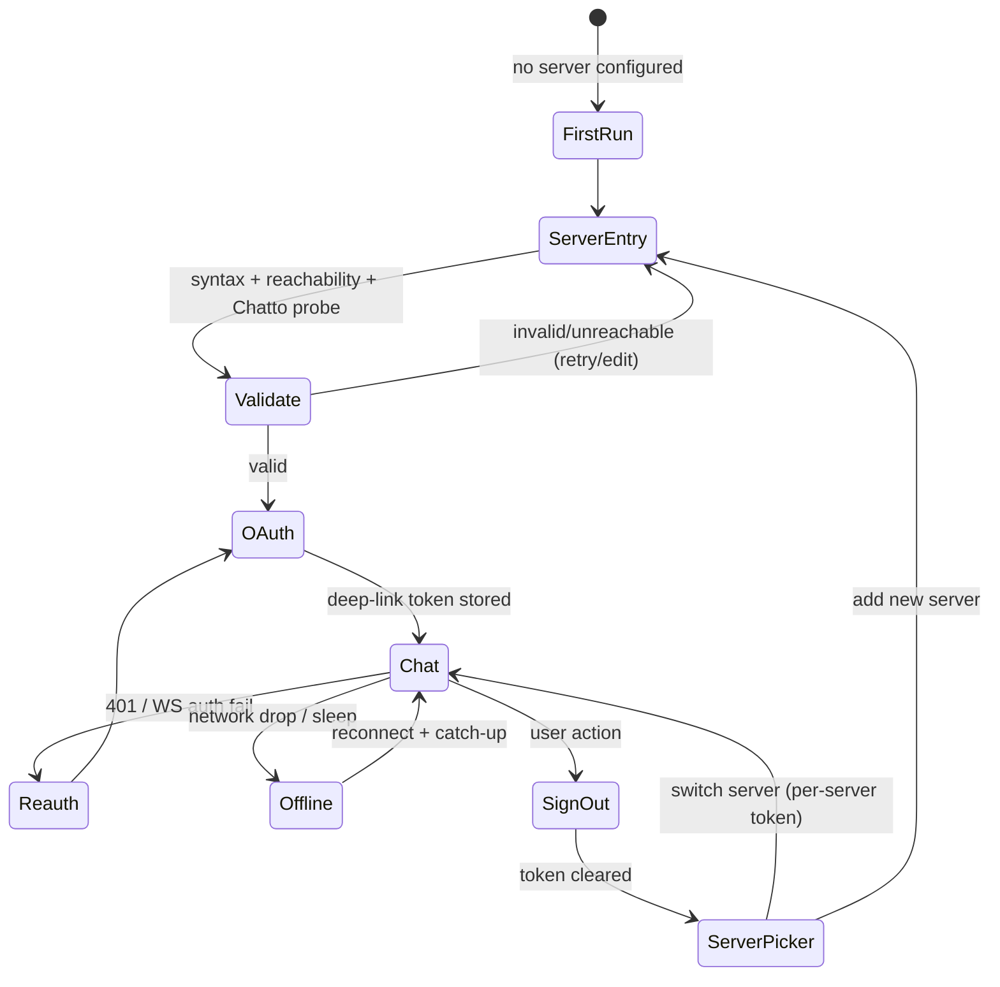

I now have enough grounding: the sibling research report (Tauri/SvelteKit integration facts), memory #12881, and the task's stated frontend integration facts (localStorage registry, `+layout.ts` origin discovery, `oauth/popup.ts` postMessage flow, SW no-op, 200.html rename, single-instance requirement). The upstream Chatto repo isn't checked out locally, which is a residual risk I'll note.

Here is the user-flow completeness analysis for the **Verity** plan.

---

# Verity — User-Flow Completeness Analysis

## User Flows

**Flow 1 — First-run onboarding (no server configured)**
App launches → no `RegisteredServer` in localStorage (and/or no wrapper-side server config) → server-URL entry screen → user types URL → wrapper validates (syntax → reachability → "is this a Chatto server?") → URL injected before `+layout.ts` runs → SPA boots against that server → OAuth sign-in → chat.

**Flow 2 — Normal launch (configured + token valid)**
App launches → wrapper injects stored server URL before `+layout.ts` → SPA finds `RegisteredServer` + bearer token in localStorage → REST bootstrap → native WebSocket connects → chat list loads → notifications/badge active.

**Flow 3 — OAuth sign-in (system browser + deep link)**
User clicks "Sign in" → wrapper opens system browser at server OAuth authorize URL → user authenticates → server redirects to `verity://auth/callback?...` → (macOS: running app gets event; Windows/Linux: second process spawns, single-instance forwards argv) → app receives callback → token exchanged/stored in the per-server `RegisteredServer` entry → webview navigates to chat.

**Flow 4 — Token expiry / forced re-auth**
Server returns 401 on REST or WS auth fails → frontend must trigger re-auth (not dead-end) → OAuth re-run (Flow 3) → new token replaces old in the same registry entry → WS reconnects.

**Flow 5 — Realtime connection lifecycle**
WS connected → network drop / laptop sleep / server restart → detect (heartbeat timeout/close) → backoff reconnect → re-subscribe + catch up missed messages → on prolonged failure show offline banner; queued messages held or failed.

**Flow 6 — Notification → deep navigation**
Message arrives (window unfocused/minimized) → bridged `tauri-plugin-notification` fires, badge count increments → user clicks notification → window focuses/restores → webview navigates to the specific channel/message → badge for that channel clears.

**Flow 7 — Multi-server switching**
User has ≥2 `RegisteredServer` entries → switches server in frontend → per-server token used → WS torn down and re-established to new server → notification/badge state re-scoped → (and the inverse: adding a *new* server from desktop, which re-runs Flow 1+3 for that server).

**Flow 8 — Sign-out**
User signs out → token removed from registry → WS closed → badge cleared → notification listeners torn down → return to sign-in or server-picker state.

**Flow 9 — Change/remove server URL**
User edits or removes the configured server → what happens to the stored registry entry/token, and does the wrapper's injected URL change require a webview reload?

---

## Gaps

### Critical

1. **Server-URL validation semantics unspecified.** What proves "this is a Chatto server" — a health/version endpoint? Minimum server version vs. pinned frontend? An unreachable, non-Chatto, or version-mismatched URL entered at first run currently has no defined error state, and `+layout.ts` will boot against garbage. *Grounding:* the research report shows `+layout.ts` discovers the server from `url.origin`, which is `tauri://localhost` — so the wrapper *must* inject the URL; a bad injection has no fallback. **Blocks first-run.**

2. **Deep-link delivery on Windows/Linux without defined single-instance contract.** The research is explicit: deep links arrive as `argv` to a *new* process; without single-instance registered **first** (with the `deep-link` feature) the user gets a second window and the original sits on the login screen forever (gethouston/houston 34dfc23). The plan must state this as a hard requirement, not an aside, or OAuth is dead on 2 of 3 platforms.

3. **Token storage location/migration.** Frontend persists `RegisteredServer`+token in localStorage. Is that acceptable for desktop, or must the token move to OS keychain/secure storage? If keychain, who owns read/write (wrapper Rust vs. frontend localStorage) and how do they stay in sync on re-auth? Unspecified = tokens either ship in plaintext webview storage or the two stores drift.

4. **CORS / fetch strategy for the user-configured server.** Webview origin is `tauri://localhost` / `http://tauri.localhost`; plain `fetch` to the configured server will be CORS-blocked. Research says `tauri-plugin-http` (broad `https:*` scope + runtime URL validation) or a Rust localhost proxy. The plan must pick one and specify runtime URL validation — otherwise the chat UI can't call the API at all.

### Important

5. **OAuth provider redirect-scheme constraint.** Custom `verity://` scheme works for Keycloak/Auth0/Supabase OIDC but **Google and GitHub forbid custom schemes** — those require a loopback (`127.0.0.1:<port>`) strategy. Plan should define an `startOAuthFlow()` abstraction with deep-link and loopback strategies, or state v1 explicitly excludes providers that ban custom schemes.

6. **Re-auth UX loop.** On 401, does the frontend auto-launch OAuth, show a "session expired" interstitial, or silently retry N times? What if the user is mid-compose? Unspecified = each developer resolves it differently.

7. **Offline/reconnect message-integrity.** On WS reconnect: how are missed messages back-filled, and what happens to messages composed while offline (queued? dropped? shown failed)? Exponential backoff + jitter parameters and an "offline" banner are unmentioned.

8. **Notification-click → webview navigation contract.** `tauri-plugin-notification` click must focus/restore the window and route the webview to the specific channel/message, then decrement the badge. The payload shape (server + channel + message id) and the frontend route to consume it are unspecified. Windows has no numeric badge — `setOverlayIcon` fallback must be stated.

9. **Multi-server: which server's notifications?** With a per-server registry, does the app maintain one WS (active server only) or multiple? Badge = aggregate or active-server-only? If active-only, messages on inactive servers are silently missed — a real UX regression vs. the web app.

10. **Sign-out scope.** Sign out of one server or all? Does it clear the registry entry, the badge, and any pending notification listeners? Partial sign-out leaves stale tokens/WS.

11. **Linux divergence.** Research: WebKitGTK has **no WebRTC/getUserMedia** (voice/screenshare macOS+Windows only — already deferred, fine), but also: notifications via libappindicator, Wayland/X11 rendering quirks, and the badge path differs. Plan should name Linux as tier-2 and define what "works" means there for v1.

### Minor

12. **`200.html` → `index.html` rename seam** — must be a `prepare-dist` step in the wrapper (research §1.1). Low risk once scripted, but easy to forget; without it Tauri has no entry page.

13. **Deep link when app is fully closed (cold start)** — `getCurrent()` on load vs. `onOpenUrl` for warm start; plan should require handling both or the OAuth callback is dropped on cold start.

14. **Updater / pinned-frontend version skew** — no mention of how the wrapper ships a new pinned upstream build or prompts update; for v1 a manual release is a reasonable default.

15. **Second-instance non-auth deep links / protocol abuse** — any `verity://` URL launches/focuses the app; plan should note argv validation so a malicious link can't inject a URL.

---

## Questions (priority order)

1. **What validates a "Chatto server" at first-run URL entry — a specific endpoint, and is there a minimum server version the pinned frontend requires?** *Stakes:* without it the app boots against garbage and fails opaquely inside `+layout.ts`. *Default:* probe `GET <url>/api/v1/server/info` (or equivalent), require 200 + expected shape, else inline error with edit/retry.

2. **Where do bearer tokens live on desktop — localStorage (frontend-owned) or OS keychain (wrapper-owned), and who syncs on re-auth?** *Stakes:* plaintext token storage vs. store drift. *Default:* keep frontend localStorage as source of truth for v1; note keychain as a follow-up.

3. **Do we use `tauri-plugin-http` (broad scope + runtime URL validation) or a Rust localhost proxy for API calls to the configured server?** *Stakes:* without one, CORS blocks all API calls from `tauri://localhost`. *Default:* `tauri-plugin-http` with `https:*` scope + Rust-side validation of the configured URL.

4. **Which OAuth providers must v1 support, and do any forbid custom-scheme redirects (Google/GitHub)?** *Stakes:* decides deep-link-only vs. needing the loopback strategy too. *Default:* implement deep-link first; add loopback only if a required IdP bans custom schemes.

5. **On WS reconnect, how are missed messages back-filled and how are offline-composed messages handled?** *Stakes:* silent message loss. *Default:* catch-up fetch on reconnect; queue outgoing messages locally and flush, marking failures.

6. **With multiple registered servers, is there one WebSocket (active server) or several, and is the badge active-server-only or aggregate?** *Stakes:* missed notifications on inactive servers. *Default:* v1 = single active WS, badge reflects active server; document as a known limitation.

7. **Is single-instance + deep-link (registered first, `deep-link` feature) a stated hard requirement for Windows/Linux OAuth?** *Stakes:* OAuth dead on 2/3 platforms if omitted. *Default:* yes, mandatory.

8. **What is the notification-click payload and the frontend route it navigates to, and what is the Windows badge fallback (`setOverlayIcon`)?** *Stakes:* notification click does nothing / wrong badge on Windows. *Default:* payload `{serverId, channelId, messageId}` → focus window + `goto(/channels/{channelId}?msg={messageId})`; Windows uses a pre-rendered overlay dot.

9. **Does sign-out clear one server or all, and does it reset badge + notification listeners?** *Stakes:* stale tokens/WS after logout. *Default:* sign-out is per-server, clears that entry, badge, and closes its WS.

10. **For Linux, what is the v1 definition of done given WebKitGTK limits (no WebRTC, notification/badge differences)?** *Stakes:* "works on Linux" is ambiguous. *Default:* tier-2 — chat + notifications + badge; voice/screenshare explicitly gated off.

---

## Recommended Next Steps

1. Resolve Q1–Q4 (server validation, token store, CORS strategy, OAuth providers) — these are implementation blockers.
2. Have the plan author add an explicit **state machine** for auth + connection states (the diagram above) so re-auth, offline, and sign-out transitions are unambiguous.
3. Add a "hard requirements" section to the plan: single-instance-first plugin ordering, `prepare-dist` 200→index rename, macOS entitlements + CSP `wss:`/`mediastream:` seams for future LiveKit.
4. Write the notification-click payload/route contract (Q8) into the plan before any notification bridging code.
5. Confirm the pinned upstream build exposes a health/version endpoint for first-run validation; if not, that's a required upstream change.

---