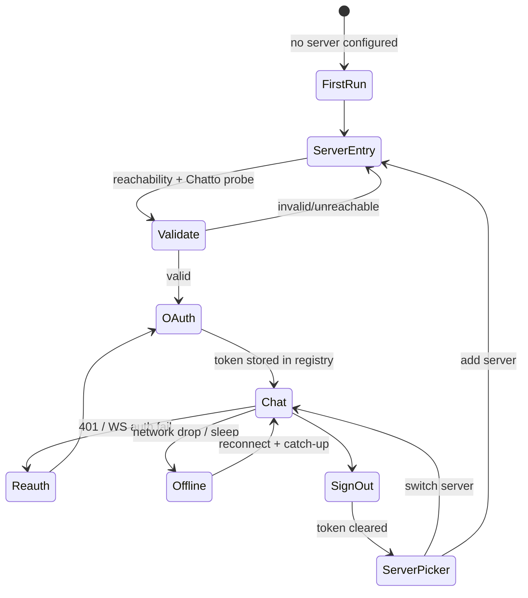

# feat: Solander — Tauri desktop wrapper for Chatto

## Summary

Build **Solander**, a standalone Tauri v2 desktop application that wraps the Chatto chat frontend (a SvelteKit static SPA) in a native webview for macOS, Windows, and Linux. The wrapper consumes a pinned upstream Chatto frontend build, lets the user point it at any Chatto server, sign in via OAuth (system browser + deep-link/loopback redirect), chat over a persistent WebSocket, and receive OS notifications with an app badge. Voice/video/screenshare (LiveKit) is explicitly deferred to a later iteration, but the plan leaves the necessary seams (CSP, macOS entitlements, media abstraction) so it can be added without re-architecting.

**Target repo:** this repository (`chatto-desktop`, to be renamed `solander`). All paths below are relative to the repo root.

---

## Problem Frame

Chatto ships as a web app and a self-hostable server, but there is no official desktop client, and the upstream project is not accepting outside contributions. Users who want a desktop experience — persistent presence, OS notifications, dock/taskbar badge, deep links, independent window — currently must run a browser tab. Solander provides that desktop experience by wrapping the existing, already-static-SPA Chatto frontend in Tauri, without forking the frontend or contributing upstream. The frontend's Apache-2.0 license permits this reuse; the `NOTICE` file forbids using Chatto names/logos as branding, so the app ships under its own name (Solander).

The central technical challenge is that the Chatto frontend is written assuming it is served **from** a Chatto server: it discovers its API origin from its own `url.origin`. Inside a Tauri webview the origin is `tauri://localhost`, so the frontend would try to discover a server at `tauri://localhost/api/connect` and fail. Solander's core integration work is injecting the configured server URL into the frontend's "origin" resolution before its root load runs, and bridging browser-only flows (OAuth popup, service-worker push) to their desktop equivalents.

---

## Requirements

- R1. The app launches on macOS, Windows, and Linux and renders the pinned Chatto frontend.
- R2. On first run, the user can enter a Chatto server URL; the app validates it is a reachable Chatto server before proceeding.
- R3. The user can sign in with the server's OAuth flow via the system browser, with the redirect returning to the app and the bearer token persisted.
- R4. After sign-in, the user can view and send chat messages against the configured server.
- R5. The app maintains a resilient realtime (WebSocket) connection with automatic reconnect and offline indication.
- R6. New messages raise OS notifications and update the app badge; clicking a notification focuses the app and navigates to the relevant room.
- R7. The user can sign out and can switch/add servers.
- R8. The build is reproducible from a pinned upstream Chatto ref, producing unsigned dev builds via CI.
- R9. Voice/video/screenshare seams (CSP, macOS entitlements, media abstraction) are present but the feature is not built.

---

## Scope Boundaries

- No voice, video, or screenshare (LiveKit) implementation — deferred; only seams are laid.
- No upstream contribution or fork of the Chatto frontend with behavioral changes — the frontend is consumed as a pinned build, with at most a thin injection seam.
- No code signing / notarization — unsigned dev builds for v1 (Gatekeeper/SmartScreen warnings accepted for dogfooding).
- No auto-update mechanism in v1 (manual release/reinstall; `tauri-plugin-updater` is a follow-up).
- No mobile (iOS/Android) targets.
- Not a rebrand of Chatto — Solander uses its own name/icons per the upstream `NOTICE`.
- OS keychain token storage — v1 keeps the frontend's existing localStorage token store; keychain is a follow-up.

### Deferred to Follow-Up Work

- Voice/video/screenshare via LiveKit: future iteration (macOS + Windows only; Linux WebKitGTK has no WebRTC). Seams laid in U3/U8.
- OS keychain / stronghold token storage: follow-up security hardening.
- Auto-update (`tauri-plugin-updater`): follow-up release task.
- Proper code signing (Apple Developer ID, Windows cert): follow-up release task.
- Multi-server simultaneous WebSocket connections + aggregate badge: follow-up (v1 uses single active-server connection, matching the frontend's existing behavior).

---

## Context & Research

### Relevant Code and Patterns (upstream Chatto frontend — pinned build)

- `apps/frontend/svelte.config.js` — `adapter-static` with `fallback: '200.html'`, `precompress` optional. Pure SPA.
- `apps/frontend/src/routes/+layout.ts` — `export const ssr = false`; root load calls `getPublicServerInfo(url.origin)` and `loadCurrentUser()`. **This is the origin-injection seam.**
- `apps/frontend/src/lib/api-client/connect.ts` — ConnectRPC transport (`createConnectTransport`), `connectEndpoint(baseUrl)` → `/api/connect`, bearer-token auth via `Authorization: Bearer` header.
- `apps/frontend/src/lib/api-client/server.ts` — `getPublicServerInfo(baseUrl)` hits `ServerDiscoveryService.GetServer`; returns `authorizeUrl`, `authProviders[].loginUrl`, server name/icon, and `compatibility.minimumWebClientVersion`. Used for first-run validation.
- `apps/frontend/src/lib/state/server/registry.svelte.ts` — multi-server registry persisted to localStorage (`instances` slot); `RegisteredServer` holds per-server `token`, `url`, `id`. **Bearer-token persistence already exists.**
- `apps/frontend/src/lib/state/server/serverConnection.svelte.ts` — `serverConnectionManager.originClient` exposes `connectBaseUrl` + `bearerToken` used by `loadAuth`. The wrapper must make "origin" resolve to the configured server.
- `apps/frontend/src/lib/state/server/eventBus.svelte.ts` — realtime WebSocket transport with heartbeat watchdog, reconnect, live/polling/dormant modes. **Resilient WS already exists.**
- `apps/frontend/src/lib/oauth/popup.ts` — OAuth via cross-window `postMessage` popup. **Does not work in a webview; replaced by system-browser + deep-link.**
- `apps/frontend/src/lib/notifications/pushNotifications.ts`, `pwa/notificationClick.worker.ts` — service-worker push. **Service workers do not run under `tauri://`; must bridge to `tauri-plugin-notification`.**
- `apps/frontend/src/lib/state/server/voiceCall.svelte.ts` — LiveKit voice (deferred; informs the media abstraction seam).

### Institutional Learnings

- Prior Tauri work exists in `kapa` (`clients/desktop/src-tauri/tauri.conf.json`), but it is **Tauri v1 with an embedded Vite app** — a different shape. Not directly reusable; Solander uses Tauri v2 and consumes an *external* pinned build. Treat kapa as general familiarity, not a config template.

### External References

- Tauri v2 + SvelteKit guide (`v2.tauri.app/start/frontend/sveltekit/`) — uses `fallback: 'index.html'`; upstream uses `200.html`, requiring a rename seam.
- `tauri-plugin-deep-link`, `tauri-plugin-single-instance` (with `deep-link` feature), `tauri-plugin-opener`, `tauri-plugin-notification`, `tauri-plugin-http`, `@fabianlars/tauri-plugin-oauth` (loopback).
- On Windows/Linux, deep links arrive as `argv` to a **new** process; single-instance must be registered **first** or OAuth delivery breaks (tauri issue #12726).
- Linux WebKitGTK has **no WebRTC/`getUserMedia`/`getDisplayMedia`** (wry#85, tauri#8346) — voice is macOS/Windows-only.
- Service workers and the web `Notification` path do not run under the `tauri://` custom protocol; `tauri-plugin-notification` shadows `window.Notification`.
- App badge: `setBadgeCount` (macOS/Linux), `setOverlayIcon` (Windows — no numeric badge), landed in Tauri 2.2.

---

## Key Technical Decisions

- **Consume the frontend as a pinned git ref** (release tag), fetched and built (or its artifact vendored) by the wrapper's build. Rationale: deterministic, auditable, clean license/NOTICE compliance, no fork to maintain. The wrapper is a separate repo.
- **Separate wrapper repo, not a monorepo PR.** Upstream is not accepting contributions; the Apache-2.0 frontend license permits an external wrapper.
- **Server-URL injection via a global seam, not a patched fork.** Rust/build injects the configured server URL (and a `__SOLANDER__` desktop flag) as a small script/global that the frontend reads before its root `+layout.ts` load resolves origin. Rationale: minimal coupling, avoids owning a frontend fork. The exact injection point is validated in an early spike (U2) because it depends on the frontend's module load order.
- **API transport: `tauri-plugin-http`** for ConnectRPC-over-HTTP calls to the user-configured server, scoped to `https:*`/`http:*` with runtime validation of the configured URL. Rationale: bypasses webview CORS (`tauri://localhost` origin would be blocked); a Rust proxy is unnecessary for CORS alone and does not carry the WebSocket anyway. The WebSocket connects natively from the webview (unaffected by CORS).
- **OAuth: system browser + redirect, with both deep-link and loopback strategies behind an abstraction.** Chatto's OAuth is server-mediated (the server is the OAuth client and redirects back to the web client). For Solander the web-client callback must be a URL the app controls: `solander://auth/callback` (deep link) or `http://127.0.0.1:<port>/callback` (loopback). Whether the server permits registering a non-web callback is resolved in the U5 spike; the abstraction supports both.
- **Token storage: keep the frontend's localStorage `RegisteredServer` for v1.** Rationale: zero frontend change; the deep-link/loopback callback writes the token into the same registry shape the frontend already reads. Keychain is a documented follow-up.
- **Notifications bridged to `tauri-plugin-notification`** rather than relying on the web `Notification`/service-worker path (which no-ops under `tauri://`).
- **Tauri v2 throughout**, `@tauri-apps/api` 2.x, pinned CLI/crate minor lines.

---

## Open Questions

### Resolved During Planning

- *Monorepo PR vs separate repo?* → Separate repo (upstream not accepting contributions; Apache-2.0 permits external wrapper).
- *Frontend consumption?* → Pinned git ref, built/vendored by the wrapper.
- *API transport under CORS?* → `tauri-plugin-http` + runtime URL validation.
- *Token storage?* → localStorage (frontend-owned) for v1; keychain deferred.
- *OAuth mechanism?* → System browser + deep-link, plus loopback strategy; abstraction decides per server capability.
- *Branding?* → Own name: **Solander** (per upstream NOTICE).
- *Signing?* → Unsigned dev builds for v1.

### Deferred to Implementation

- **Exact server-URL injection point** — depends on the frontend's module evaluation order and whether it exposes a config hook; resolved by the U2 spike against the real pinned build.
- **Whether the Chatto server allows a non-web OAuth redirect/callback URL** (`solander://` or `127.0.0.1`) — resolved by the U5 spike; determines deep-link vs loopback per server.
- **Notification-click payload shape and the frontend route it navigates to** — depends on the frontend's room/message routing (`/chat/[serverId]/...`); finalized in U7.
- **Final bundle identifier / deep-link scheme registration edge cases per OS** — settled during U6 wiring.

---

## Output Structure

    solander/
      package.json                  # thin — tauri CLI + build orchestration
      pnpm-workspace.yaml
      scripts/
        fetch-frontend.mjs          # clone/pin upstream chatto ref
        prepare-dist.mjs            # build frontend + rename 200.html -> index.html
      vendor/
        frontend/                   # pinned upstream build output (gitignored, CI-restored)
      src-tauri/
        Cargo.toml
        tauri.conf.json
        build.rs
        capabilities/
          default.json
        icons/
        Info.plist                  # mic/camera usage strings (voice seam)
        Release.entitlements        # audio-input/camera entitlements (voice seam)
        src/
          main.rs
          lib.rs                    # plugin registration (single-instance first)
          server_config.rs          # configured-server URL store + validation
          oauth.rs                  # deep-link + loopback strategies
          notify.rs                 # notification bridge + badge
      src/
        shell/
          boot.ts                   # reads injected config, primes frontend origin
          serverPicker.ts           # first-run server URL entry + validation
          oauthClient.ts            # frontend side of the OAuth flow
          notifyBridge.ts           # frontend -> tauri-plugin-notification bridge
          media.ts                  # media abstraction (throws "unsupported" for now)
      .github/
        workflows/
          release.yml               # tauri-action matrix build

---

## High-Level Technical Design

> *This illustrates the intended approach and is directional guidance for review, not implementation specification. The implementing agent should treat it as context, not code to reproduce.*

### Boot / origin-injection sequence

```mermaid
sequenceDiagram
    participant OS
    participant Rust as Solander (Rust)
    participant WV as Webview
    participant FE as Chatto frontend
    participant SRV as Chatto server

    OS->>Rust: launch
    Rust->>Rust: read configured server URL (server_config)
    alt no server configured
        Rust->>WV: load shell server-picker
        WV->>Rust: submit URL
        Rust->>SRV: GET ServerDiscovery.GetServer (validate)
        SRV-->>Rust: profile + minimumWebClientVersion
        Rust->>Rust: persist server URL
    end
    Rust->>WV: inject __SOLANDER__ = { serverUrl, desktop: true }
    WV->>FE: boot SPA; origin resolves to serverUrl
    FE->>SRV: getPublicServerInfo(serverUrl) / loadCurrentUser()
    alt token present
        FE->>SRV: ConnectRPC + WebSocket (bearer)
    else
        FE->>WV: show sign-in
    end
```

### Auth + connection state machine



### OAuth redirect strategies (abstraction)

```text
startOAuthFlow(serverUrl, authorizeUrl) -> Token
  ├─ DeepLinkStrategy:  open system browser -> server redirects to solander://auth/callback
  │                     -> single-instance/deep-link delivers URL -> exchange for token
  └─ LoopbackStrategy:  spawn 127.0.0.1:<port> -> server redirects to loopback
                        -> capture -> exchange for token
  Selection: per-server, resolved by U5 spike.
```

---

## Implementation Units

### U1. Project scaffold + pinned frontend fetch/build

**Goal:** A buildable Tauri v2 shell repo that fetches and builds the pinned Chatto frontend and serves it in a webview on all three OSes.

**Requirements:** R1, R8

**Dependencies:** None

**Files:**

- Create: `package.json`, `pnpm-workspace.yaml`, `src-tauri/Cargo.toml`, `src-tauri/tauri.conf.json`, `src-tauri/build.rs`, `src-tauri/src/main.rs`, `src-tauri/src/lib.rs`, `scripts/fetch-frontend.mjs`, `scripts/prepare-dist.mjs`
- Create: `.github/workflows/release.yml`

**Approach:**

- `fetch-frontend.mjs` clones `chattocorp/chatto` at a pinned tag into a build cache and runs the upstream pnpm build; output lands in `vendor/frontend/build` (gitignored, restored in CI).
- `prepare-dist.mjs` copies `200.html` → `index.html` so Tauri has an entry page (upstream SPA fallback is not rewritten by Tauri).
- `tauri.conf.json` v2: `build.frontendDist` → `../vendor/frontend/build`, `build.devUrl` → `http://localhost:5173`, `beforeBuildCommand` drives fetch+prepare. `productName: "Solander"`, `identifier: "com.solander.app"`.
- CI uses `tauri-apps/tauri-action@v1` matrix (macOS aarch64+x86_64, ubuntu-22.04, windows); Linux installs `libwebkit2gtk-4.1-dev libappindicator3-dev librsvg2-dev patchelf xdg-utils`. Unsigned artifacts uploaded as a draft release.

**Patterns to follow:**

- Tauri v2 SvelteKit guide config shape; `https://schema.tauri.app/config/2`.

**Test scenarios:**

- Integration: `tauri build` produces a launchable bundle on each OS that renders the frontend login screen.
- Error path: with no network/upstream fetch failure, the build fails with a clear message (no stale empty `vendor/`).
- Edge case: `vendor/frontend/build` contains `index.html` after prepare (asserted in prepare script output).

**Verification:** Running the produced bundle on each OS shows the Chatto frontend (unauthenticated state) without console errors about a missing entry page.

---

### U2. Server-URL injection seam (spike + implementation)

**Goal:** Make the frontend resolve its API origin to the configured server URL instead of `tauri://localhost`, with minimal/no upstream change.

**Requirements:** R2, R4

**Dependencies:** U1

**Files:**

- Create: `src/shell/boot.ts`, `src-tauri/src/server_config.rs`
- Test: `src/shell/boot.spec.ts`

**Approach:**

- Spike: determine the cleanest injection point — whether the frontend exposes a config hook, or whether a `<script>` defining `globalThis.__SOLANDER__` injected before the SPA module evaluates is sufficient for `boot.ts` to prime the origin/connection layer. Confirm against the real pinned build's module load order.
- `server_config.rs` persists the configured server URL (Tauri store) and exposes it to the webview at startup.
- `boot.ts` reads the injected config and seeds the frontend's origin/server-registry path so `+layout.ts`'s `getPublicServerInfo(url.origin)` and `loadCurrentUser()` resolve against the configured server. Prefer the smallest seam that avoids forking the frontend; a one-line upstream hook (reading an optional global) is acceptable if a pure-injection approach proves fragile.

**Execution note:** Spike first — timebox determining the injection point; do not commit to a mechanism before validating module load order against the real build.

**Technical design:** Boot writes `{ serverUrl, desktop: true }` to a well-known global before the SPA evaluates; the frontend's origin resolution reads it. Directional, not specification.

**Patterns to follow:**

- `apps/frontend/src/lib/state/server/serverConnection.svelte.ts` (`originClient`), `registry.svelte.ts` (`originServer`).

**Test scenarios:**

- Happy path: with `__SOLANDER__.serverUrl` set, the frontend issues discovery/auth requests to that URL, not `tauri://localhost`.
- Edge case: missing/empty `__SOLANDER__` → shell shows server-picker rather than booting against `tauri://localhost`.
- Error path: malformed `serverUrl` → validation error before any network call.
- Integration: root layout load completes against a mock server URL and returns server profile + null user.

**Verification:** Dev tools network panel shows `ServerDiscovery.GetServer` and `GetCurrentUser` requests going to the configured server origin.

---

### U3. First-run server entry + validation

**Goal:** A first-run screen where the user enters a Chatto server URL, validated as a reachable Chatto server before sign-in.

**Requirements:** R2

**Dependencies:** U2

**Files:**

- Create: `src/shell/serverPicker.ts`
- Modify: `src-tauri/src/server_config.rs`
- Test: `src/shell/serverPicker.spec.ts`

**Approach:**

- On launch with no configured server, present a URL entry form (shell-rendered, before SPA boot).
- Validate in order: URL syntax → reachability → Chatto probe (`ServerDiscovery.GetServer` returns a profile with a name). Surface inline errors for each failure class with edit/retry.
- Check `compatibility.minimumWebClientVersion` against the pinned frontend version; warn (not block) on mismatch.
- Persist the validated URL via `server_config.rs`, then boot the SPA (U2).

**Patterns to follow:**

- `apps/frontend/src/lib/api-client/server.ts` `getPublicServerInfo` for the probe.

**Test scenarios:**

- Happy path: valid Chatto server URL → accepted, persisted, SPA boots.
- Error path: syntactically invalid URL → inline syntax error, no network call.
- Error path: valid URL but unreachable/timeout → "cannot reach server" error with retry.
- Error path: reachable but not a Chatto server (no profile name) → "not a Chatto server" error.
- Edge case: server returns `minimumWebClientVersion` newer than the pinned frontend → non-blocking compatibility warning shown.

**Verification:** Entering each URL class yields the corresponding acceptance or inline error; a validated URL persists across relaunch.

---

### U4. Resilient realtime connection surfacing

**Goal:** Surface the frontend's existing WebSocket lifecycle (connect/reconnect/offline) correctly in the desktop shell, including OS sleep/wake.

**Requirements:** R5

**Dependencies:** U2

**Files:**

- Create: `src/shell/connectionStatus.ts`
- Test: `src/shell/connectionStatus.spec.ts`

**Approach:**

- The frontend's `eventBus.svelte.ts` already implements heartbeat watchdog, reconnect backoff, and live/polling/dormant modes — do not reimplement. This unit surfaces its `ConnectionStatus` in the shell (offline banner) and verifies behavior under desktop conditions.
- Handle laptop sleep/wake and network drop: confirm the heartbeat watchdog detects a stalled socket and reconnects with catch-up; add an offline indicator bound to the connection status.
- v1 maintains a single active-server WebSocket (matches frontend behavior); document inactive-server polling as a known limitation.

**Patterns to follow:**

- `apps/frontend/src/lib/state/server/eventBus.svelte.ts` (heartbeat, `RECONNECT_WAIT_MS`), `serverConnection.svelte.ts` (`ConnectionStatus`).

**Test scenarios:**

- Happy path: WS connects after auth; messages stream in.
- Edge case: simulated network drop → offline indicator appears within the heartbeat-stall window.
- Edge case: OS sleep for > stall window then wake → socket reconnects and re-hydrates without manual reload.
- Integration: reconnect triggers a catch-up so no messages are silently missed (diff before/after a drop).
- Error path: prolonged server outage → persistent offline state, no crash-loop, bounded backoff.

**Verification:** Dropping and restoring network while the app is open recovers the stream and shows an offline state during the outage.

---

### U5. OAuth sign-in via system browser (deep-link + loopback)

**Goal:** Sign in with the server's OAuth flow via the system browser, returning the bearer token to the app and persisting it in the frontend's registry.

**Requirements:** R3

**Dependencies:** U2, U3

**Files:**

- Create: `src-tauri/src/oauth.rs`, `src/shell/oauthClient.ts`
- Modify: `src-tauri/src/lib.rs` (register `single-instance` **first**, then `deep-link`), `src-tauri/capabilities/default.json` (`deep-link:default`, `opener:default`, `core:event:default`)
- Test: `src/shell/oauthClient.spec.ts`

**Approach:**

- Spike: determine whether the Chatto server permits a non-web OAuth redirect/callback (`solander://auth/callback` vs `http://127.0.0.1:<port>/callback`). This selects the default strategy; the abstraction keeps both.
- Replace the frontend's `postMessage` popup flow: shell opens the system browser at the server's `authorizeUrl`/`loginUrl` via `tauri-plugin-opener`.
- **Deep-link strategy:** register `solander` scheme; on Windows/Linux the URL arrives as `argv` to a new process, so `single-instance` (with `deep-link` feature) is registered **first** and forwards it. Handle both cold start (`getCurrent()`) and warm start (`onOpenUrl`).
- **Loopback strategy:** spawn a temporary `127.0.0.1` server to capture the redirect.
- On callback, validate `state`, exchange for a token, and write it into the frontend's `RegisteredServer` registry shape so `loadCurrentUser()` picks it up. Navigate the webview to chat.
- Validate all incoming `solander://` argv before acting (protocol-abuse guard).

**Execution note:** Spike the server's redirect/callback tolerance first; do not hard-code deep-link before confirming the server accepts the scheme.

**Patterns to follow:**

- `apps/frontend/src/lib/oauth/popup.ts` (state envelope to mirror), `registry.svelte.ts` (`RegisteredServer.token`), upstream `server.ts` `authorizeUrl`.

**Test scenarios:**

- Happy path: complete OAuth round-trip stores a bearer token and lands on chat authenticated.
- Edge case: cold start via deep link (app fully closed) → callback captured via `getCurrent()`, sign-in completes.
- Edge case: warm start (app running) → callback captured via `onOpenUrl`.
- Error path: callback with `error`/`error_description` → sign-in error surfaced, no token written.
- Error path: `state` mismatch → callback rejected (CSRF guard).
- Integration (Windows/Linux): a second process launched with a `solander://` argv forwards to the running instance and does not open a second window.
- Error path: malicious/unsolicited `solander://` URL with unexpected path → ignored after argv validation.

**Verification:** Signing in through the real server yields an authenticated session that survives relaunch (token persisted), on all three OSes.

---

### U6. Deep links, window, and CSP hardening

**Goal:** Register the `solander://` scheme for room/message deep links, set a strict CSP that still allows the configured server, and add macOS entitlements/usage strings for future voice.

**Requirements:** R1, R9

**Dependencies:** U1, U5

**Files:**

- Modify: `src-tauri/tauri.conf.json` (`app.security.csp`, `plugins.deep-link.desktop.schemes`), `src-tauri/src/lib.rs`
- Create: `src-tauri/Info.plist`, `src-tauri/Release.entitlements`
- Test: `src/shell/deepLink.spec.ts`

**Approach:**

- CSP: `default-src 'self' tauri: asset:`; `connect-src ipc: http://ipc.localhost https: wss:` (covers the configured server's API **and** future LiveKit signaling); `media-src 'self' blob: mediastream:` (voice seam); keep `script-src 'self'` tight. Do not ship `csp: null`.
- Register `solander` deep-link scheme for in-app navigation (room/message links open the app and route the webview).
- Add macOS `Info.plist` mic/camera usage strings and `Release.entitlements` audio-input/camera keys now (unused) so voice later needs no entitlement re-architecture; reference under `bundle.macOS.entitlements`.

**Patterns to follow:**

- External research §4.2 (CSP), §6 (entitlements/seams); Tauri deep-link docs.

**Test scenarios:**

- Happy path: clicking a `solander://chat/<server>/<room>` link focuses the app and navigates to the room.
- Error path: deep link with unknown path → ignored safely (no navigation to arbitrary URL).
- Edge case: CSP blocks an inline script that violates it (confirm policy active) while still permitting `wss:` to the configured server.
- Edge case: app cold-launched by a deep link routes correctly after boot.

**Verification:** A `solander://` room link opens the app to the right room; CSP report shows no unintended violations while API/WS calls succeed.

---

### U7. OS notifications + app badge bridge

**Goal:** New messages raise OS notifications and update the app badge; clicking a notification focuses the app and navigates to the room.

**Requirements:** R6

**Dependencies:** U2, U4

**Files:**

- Create: `src-tauri/src/notify.rs`, `src/shell/notifyBridge.ts`
- Modify: `src-tauri/capabilities/default.json` (`notification:default`)
- Test: `src/shell/notifyBridge.spec.ts`

**Approach:**

- Detect Tauri (`'__TAURI__' in window`) and route notifications through `@tauri-apps/plugin-notification` (`isPermissionGranted`/`requestPermission`/`sendNotification`); the web service-worker path no-ops under `tauri://` and must not be relied on.
- Subscribe to the frontend's mention/DM transient events (`realtimeEvents.ts` `MentionNotification`/`NewDirectMessageNotification`) to trigger notifications when the window is unfocused.
- Badge: derive unread count from the frontend's existing unread state and call `setBadgeCount` (macOS/Linux), clearing with `undefined` at zero; on Windows use `setOverlayIcon` (no numeric badge).
- Notification click: focus/restore the window and navigate the webview to the specific room/message (payload carries server + room + message id); clear that room's badge contribution.

**Patterns to follow:**

- `apps/frontend/src/lib/realtimeEvents.ts` (transient mention/DM events), `lib/notifications/` (existing permission flow to mirror).

**Test scenarios:**

- Happy path: message arrives with window unfocused → OS notification appears and badge increments.
- Integration: clicking the notification focuses the window and navigates to the message's room; badge for that room clears.
- Edge case: window focused → no OS notification (in-app only), badge still updates.
- Edge case: permission denied → no notification, no crash, in-app behavior unchanged.
- Edge case (Windows): badge uses overlay icon, not a numeric count.
- Error path: notification on inactive server (v1 single-WS) → documented as not delivered (known limitation).

**Verification:** With the app minimized, a mention produces a notification + badge; clicking it opens the app to that room and clears the badge.

---

### U8. Voice/media abstraction seam (no implementation)

**Goal:** Route all future media acquisition through one module so LiveKit can drop in later without touching call sites; do not build voice.

**Requirements:** R9

**Dependencies:** U2

**Files:**

- Create: `src/shell/media.ts`
- Test: `src/shell/media.spec.ts`

**Approach:**

- Define a narrow interface (`getMic()`, `getCamera()`, `getScreen()`, `joinRoom()`) that today throws/returns "unsupported on this platform."
- Record per-platform capability (macOS/Windows potentially supported; Linux WebKitGTK unsupported) so the future feature can gate itself. No LiveKit wiring in this plan.

**Patterns to follow:**

- `apps/frontend/src/lib/state/server/voiceCall.svelte.ts` (the consumer this will eventually serve).

**Test scenarios:**

- Happy path: calling `getMic()` returns a typed "unsupported" result (not an unhandled exception).
- Edge case: capability query reports Linux as media-unsupported, macOS/Windows as potentially-supported.

**Verification:** The abstraction exists, is the single entry point for media, and reports capability per platform; no voice UI is exposed.

---

## System-Wide Impact

- **Interaction graph:** The wrapper sits *around* the frontend, not inside it. Touch points are: origin resolution (U2), OAuth (U5, replacing the popup), notifications (U7, replacing SW push). All other frontend behavior (chat, rooms, WS) is reused unchanged.
- **Error propagation:** Server-unreachable, auth-failure, and version-mismatch errors must surface in the shell (server-picker / sign-in), not dead-end inside the SPA. The U2 seam is the boundary where shell errors become frontend-visible states.
- **State lifecycle risks:** The configured-server store (`server_config.rs`) and the frontend's localStorage registry must not drift — v1 treats the frontend registry as the token source of truth and the Rust store as only the server-URL source of truth. Sign-out clears the registry entry; it does not delete the configured server URL.
- **API surface parity:** None — the wrapper does not change the ConnectRPC API; it only routes to a configurable origin.
- **Integration coverage:** OAuth round-trip, reconnect-catch-up, and notification-click-navigation are cross-layer and cannot be proven by unit tests alone; each has an explicit integration scenario above.
- **Unchanged invariants:** The Chatto frontend's chat, room, and realtime logic is not modified beyond the thin origin/notification seams. The ConnectRPC protocol and the server's API contract are untouched.

---

## Risks & Dependencies

| Risk | Mitigation |
|------|------------|
| Upstream `fallback: '200.html'` yields no `index.html` entry | `prepare-dist.mjs` renames `200.html`→`index.html` (U1) |
| Origin-injection seam proves fragile without an upstream hook | U2 spike validates against the real build; a one-line upstream global-read hook is the accepted fallback |
| Chatto server rejects non-web OAuth redirect/callback | U5 spike tests `solander://` and loopback; abstraction supports both |
| `tauri-plugin-http` wide scope relaxes CSP | Runtime-validate the configured URL in Rust before issuing; document the relaxation |
| Linux WebKitGTK has no WebRTC | Voice deferred and gated; Linux is tier-2 for media (chat/notifications/badge still work) |
| Deep-link OAuth broken on Windows/Linux without single-instance | `single-instance` (deep-link feature) registered **first** in `lib.rs` (U5) |
| Service-worker push silently no-ops | Bridge to `tauri-plugin-notification` (U7); never rely on the SW path |
| Upstream frontend changes break the pinned build on upgrade | Pin to a known-good tag; upgrade deliberately with a compatibility check (U3 version probe) |
| Token in plaintext localStorage | Accepted for v1; keychain hardening is a documented follow-up |

---

## Documentation / Operational Notes

- Rename repo `chatto-desktop` → `solander` during U1; bundle identifier `com.solander.app`, scheme `solander://`.
- README: how to pin/bump the upstream Chatto ref, how to produce a dev build, and the Linux WebKitGTK media caveat.
- Release process: CI `tauri-action` draft release with unsigned artifacts; signing/notarization and auto-update are follow-ups.

---

## Sources & References

- Upstream frontend (pinned build): `apps/frontend/` in `github.com/chattocorp/chatto` — key files listed under Context & Research.
- Upstream license boundary: `LICENSING.md`, `NOTICE`, `REUSE.toml` (frontend Apache-2.0; no Chatto branding for forks).
- External research: Tauri v2 + SvelteKit wrapper, OAuth deep-link/loopback, notification bridge, CSP for dynamic server, tauri-action CI, WebKitGTK WebRTC limits.
- Related user prior art: `kapa/clients/desktop/src-tauri/tauri.conf.json` (Tauri v1, embedded app — reference only).
